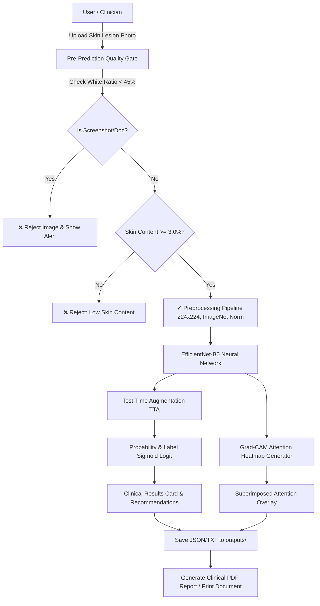

# 🔬 SkinLens AI — Professional Medical Diagnostic Screen

[](https://pytorch.org/)
[](https://streamlit.io/)
[](https://opencv.org/)
[](https://albumentations.ai/)
[](LICENSE)

> **SkinLens AI** is an advanced, deep-learning clinical decision-support web application for automated skin lesion risk assessment. Built with **PyTorch**, **EfficientNet-B0**, **Grad-CAM neural interpretability**, and **Streamlit**, it provides dermatological risk predictions (Malignant vs. Benign), model interpretability overlays, patient scan history tracking, and lab-style PDF report generation.

---

## 📋 Table of Contents

- [Overview & Architecture](#-overview--architecture)
- [Key Features](#-key-features)
- [Repository Structure](#-repository-structure)
- [Installation & Environment Setup](#-installation--environment-setup)
- [Usage Guide](#-usage-guide)
- [Inference & Preprocessing Pipeline](#-inference--preprocessing-pipeline)
- [Neural Interpretability (Grad-CAM)](#-neural-interpretability-grad-cam)
- [Patient Reports & PDF Generation](#-patient-reports--pdf-generation)
- [Model Architecture & Hyperparameters](#-model-architecture--hyperparameters)
- [Medical Advisory & Safety Notice](#-medical-advisory--safety-notice)

---

## 🏗 Overview & Architecture

SkinLens AI is engineered to bridge Kaggle model training workflows with a high-end, responsive clinical web interface. It allows clinicians and researchers to analyze dermatological photos, inspect feature activation maps, and store diagnostic audit trails.



---

## ✨ Key Features

- **🛡 Pre-Prediction Quality Gate**:
  - Automatically screens uploads using OpenCV YCrCb skin-color space heuristics and brightness histograms.
  - Blocks document scans, screenshots, and non-skin photographs before triggering neural inference.

- **⚡ EfficientNet-B0 Binary Classification**:
  - Leverages pre-trained EfficientNet-B0 with custom classifier heads for binary malignancy scoring (Malignant / Benign).
  - Robust fallback to a lightweight multi-layer CNN architecture if `torchvision` EfficientNet is unavailable.

- **🔬 Test-Time Augmentation (TTA)**:
  - Multi-pass inference averaging original, horizontal flip, and vertical flip transformations for reduced variance and higher clinical confidence.

- **🔥 Grad-CAM Neural Interpretability**:
  - Visualizes class activation maps on the final convolutional feature layer to highlight anatomical regions of interest causing the model prediction.

- **📄 Clinical Consultation PDF Reports**:
  - Generates lab-formatted PDF diagnostic sheets complete with patient metadata, clinician remarks, decision metrics, and side-by-side Grad-CAM visualizations using ReportLab.

- **📊 Training Metrics & Checkpoint Manager**:
  - Interactive training/validation loss and accuracy curves plotted from `models/history.csv`.
  - Supports uploading custom `.pth` or `.pt` PyTorch checkpoints dynamically at runtime.

---

## 📂 Repository Structure

```directory
SkinLens-AI/
├── app.py                     # Streamlit application UI, navigation, and workflow controller
├── predict.py                 # Checkpoint loading, state dict extraction, and TTA inference engine
├── model.py                   # BaselineModel architecture (EfficientNet-B0 fallback to CNN)
├── transforms.py              # Inference preprocessing pipeline (224x224 resize, ImageNet mean/std)
├── gradcam.py                 # Grad-CAM heatmap and superimposed overlay generator
├── pdf_generator.py           # ReportLab medical diagnostic PDF generation script
├── verify_env.py              # Environment package verification script
├── models/
│   ├── best_model.pth         # Default trained PyTorch weight checkpoint
│   ├── model_config.json      # Model architecture hyperparameters & loss configuration
│   └── history.csv            # Training and validation epoch loss/accuracy logs
├── notebooks/                 # Kaggle notebook training assets and reference pipelines
├── uploads/                   # Temporary & saved image uploads
├── uploaded_models/           # Saved user-uploaded PyTorch weight checkpoints
└── outputs/                   # Diagnostic results (JSON, TXT, and Grad-CAM overlay PNGs)
```

---

## ⚙️ Installation & Environment Setup

### Prerequisites
- **Python**: `3.10` or higher recommended
- **OS**: Windows, macOS, or Linux

### Step-by-Step Setup

1. **Clone the Repository**:
   ```bash
   git clone https://github.com/vaibhavchau37/SkinLens-AI.git
   cd SkinLens-AI
   ```

2. **Create & Activate a Virtual Environment**:
   - **Windows (PowerShell)**:
     ```powershell
     python -m venv venv
     .\venv\Scripts\Activate.ps1
     ```
   - **Linux / macOS**:
     ```bash
     python3 -m venv venv
     source venv/bin/activate
     ```

3. **Install Dependencies**:
   ```bash
   pip install streamlit torch torchvision opencv-python pillow albumentations reportlab matplotlib numpy
   ```

4. **Verify Environment**:
   ```bash
   python verify_env.py
   ```

---

## 🚀 Usage Guide

### Launching the Application

Run the Streamlit web app:
```bash
streamlit run app.py
```

The application will open automatically in your browser at **`http://localhost:8501`**.

### Navigating the Panel

| Menu Tab | Description |
| :--- | :--- |
| **🏠 Home** | Dashboard overview with total scan metrics, benign/malignant case breakdown, clinical workflow steps, and safety advisories. |
| **🔍 Prediction** | Upload skin photos, run pre-prediction quality checks, execute neural inference, view malignancy probabilities, and inspect Grad-CAM overlays. |
| **📜 History** | Browse previously analyzed scans, review timestamps, view confidence scores, generate individual case reports, or delete records. |
| **📊 Reports** | Formulate patient diagnostic reports, add clinician observations, download lab-style PDFs, or print diagnostic sheets. |
| **🔬 Model Info** | Inspect network specs, view epoch loss/accuracy progression charts, and upload custom PyTorch checkpoints (`.pth`/`.pt`). |
| **ℹ️ About** | Project technical overview, ISIC dataset background, and an interactive clinical **ABCDE** melanocytic warning checklist. |

---

## 🧪 Inference & Preprocessing Pipeline

To maintain 100% fidelity with the Kaggle training pipeline, incoming images are transformed as follows:

```python
# Inference transform pipeline (transforms.py)
valid_transform = A.Compose([
    A.Resize(height=224, width=224),
    A.Normalize(
        mean=(0.485, 0.456, 0.406),  # ImageNet Mean
        std=(0.229, 0.224, 0.225)   # ImageNet Standard Deviation
    ),
    ToTensorV2()
])
```

### Classification Rules
- **Logit Conversion**: Sigmoid function \(\sigma(z) = \frac{1}{1 + e^{-z}}\) maps model output to probability \(P(\text{Malignant})\).
- **Label Mapping**:
  - `Malignant` if \(P(\text{Malignant}) \ge 0.50\) (HIGH RISK)
  - `Benign` if \(P(\text{Malignant}) < 0.50\) (LOW RISK)
- **Confidence Metric**: Calculated as \(2 \times |P - 0.50|\), measuring distance from the decision boundary.

---

## 📐 Model Architecture & Hyperparameters

| Parameter | Configuration |
| :--- | :--- |
| **Backbone Architecture** | EfficientNet-B0 (Pretrained ImageNet weights) |
| **Input Dimensions** | `3 x 224 x 224` |
| **Classifier Head** | Dropout (`0.3`) $\rightarrow$ Linear (`1280` $\rightarrow$ `1`) |
| **Loss Function** | `BCEWithLogitsLoss` (Binary Cross-Entropy) |
| **Optimizer** | `AdamW` ($\text{lr} = 10^{-4}$, weight decay $= 10^{-2}$) |
| **Scheduler** | `CosineAnnealingLR` |
| **Normalization** | ImageNet Mean (`0.485, 0.456, 0.406`), Std (`0.229, 0.224, 0.225`) |

---

## 🩺 Medical Advisory & Safety Notice

> [!IMPORTANT]
> **Clinical Decision Support Only**: SkinLens AI is designed strictly as a probabilistic decision support tool for clinical researchers and medical professionals. Classifications produced by the neural network do **not** constitute a formal medical diagnosis. All skin lesions must undergo dermoscopy and histopathological tissue biopsy by a licensed dermatologist.

---

## 📄 License

Distributed under the MIT License. See `LICENSE` for details.
